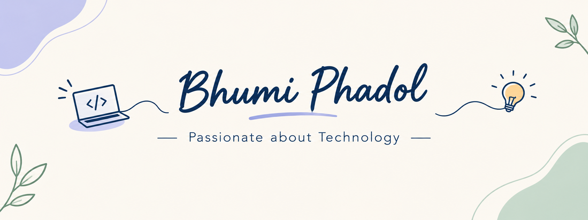

#  Hi, I'm Bhumi

### 💻 IT Engineering Student

Passionate about technology and continuously learning new skills.

## 🚀 Currently Learning

- ☕ Java & DSA
- 🤖 AI/ML
- ⚛️ React
- 🐧 Linux
- ☁️ Cloud Computing
---

## 🛠️ Tech Stack

### Languages

### Frontend

### Tools

---

## 🎯 My Goal

To strengthen my problem-solving skills, explore AI/ML,
and become a well-rounded software engineer.

---

## 🤝 Connect With Me

